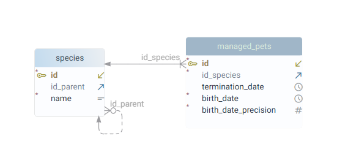
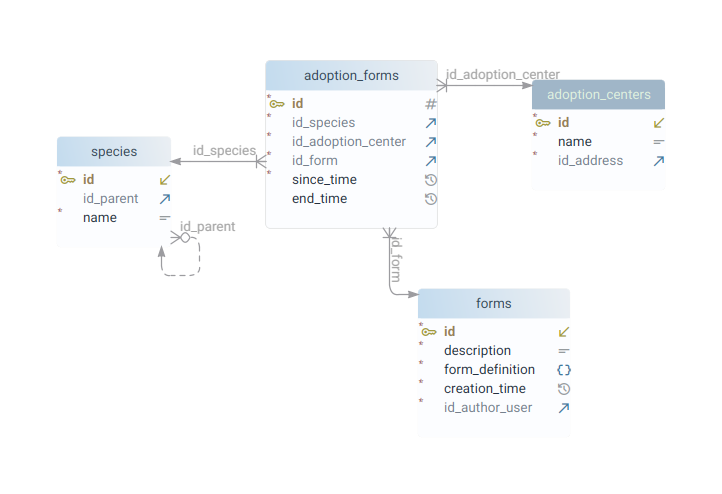
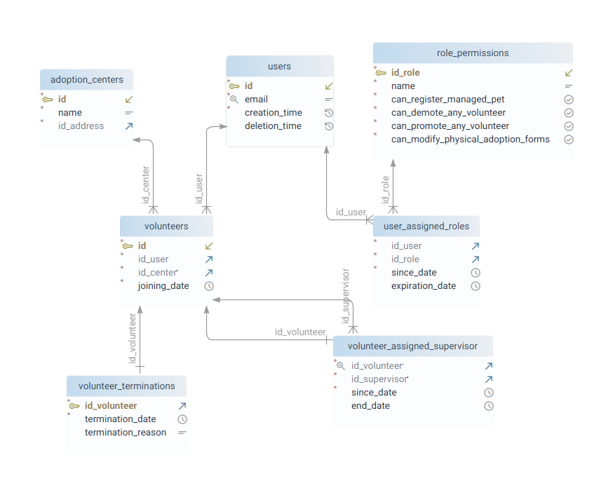
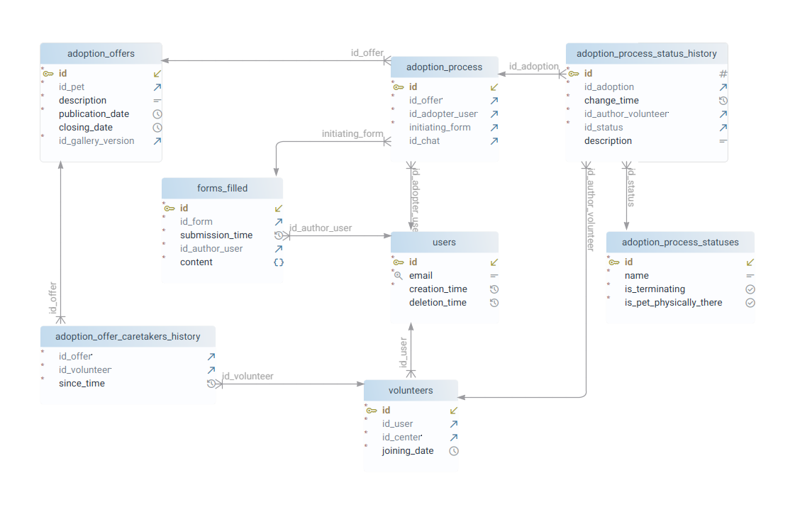

#+TITLE: Chomiczy Przytułek (projekt ID 2026, etap 1)
#+AUTHOR: Adam Maleszka, Józef Potaczek, Patryk Rosół, Dominik Kaim
#+HTML_HEAD: <link rel="stylesheet" type="text/css" href="https://gongzhitaao.org/orgcss/org.css"/>

* Wprowadzenie

Piszemy bazę pod backend platformy /Stowarzyszenia Pomocy Chomikom/. Jest to
organizacja, której głównym celem jest znajdowanie bezpiecznych domów chomikom i
promowanie dobrych praktyk traktowania zwierząt.

W skład Stowarzyszenia wchodzą liczne Centra Adopcyjne będące fizycznymi
placówkami, do których trafiają chomiki z schronisk, a także interwencji
wolontariuszy. Chomiki te są klasyfikowane przez wolontariuszy, przygotowywany
jest im opis, a następnie wystawiana jest oferta adopcyjna.

Każdy użytkownik odwiedzający stronę może przejrzeć wystawione do adopcji
chomiki, a następnie przystąpić do procesu adopcyjnego. Każda aplikacja
adopcyjna zaczyna się od wystawienia formularza, a kończy się podpisaniem umowy
adopcyjnej. Cały proces prowadzony jest poprzez funkcję czatu użytkownika z
wolontariuszem będącym tak zwanym /opiekunem oferty/. Po podpisaniu umowy
adopcyjnej Stowarzyszenie nadal utrzymuje kontakt z adoptującym, prowadzone są
wizyty kontrolne i uzupełniana jest dokumentacja medyczna danego zwierzęcia.

* Ograniczenie zakresu bazy danych

Zbierane informacje ograniczyliśmy wyłącznie do funkcjonalności wymaganych, by
dostarczyć Stowarzyszeniu i użytkownikowi możliwie funkcjonalną platformę. W tym
zdecydowaliśmy się, że nie przechowujemy wewnętrznych danych Stowarzyszenia, a
jedynie te, które w jakiś sposób mają być wypisywane adoptującemu.

Z początku planowaliśmy także dosyć nowatorskie rozwiązania, w tym wirtualne
adopcje i możliwość zgłaszania się użytkowników jako /Przytułek/ (czyli Dom
Tymczasowy). Miało działać to tak, że jeśli dany użytkownik nie jest w stanie
przyjąć jakiegoś chomika pod swój dach, ale chciałby zapewnić mu dach nad głową,
to za miesięczną subskrypcją może przekazać takiego chomika do jednego z
/Przytułków/. Wówczas otwiera się czat użytkownika z takim Przytułkiem i
użytkownik może dopytywać się, co tam u jego chomika, dostawać zdjęcia, a nawet
umawiać się na wizyty stacjonarne. Przytułek miałby swój własny Profil, na
którym udostępniane byłyby posty, galerie, a każda działalność Przytułka byłaby
weryfikowana przez przypisanych wolontariuszy.

Niestety, w trakcie projektowania bazy tego systemu okazało się, że całość
platformy wymaga 50+ tabel i z przyczyn racjonalnych postanowiliśmy ograniczyć
zakres projektu, wbrew złożonej pierwotnie deklaracji na MS Teams.

Nie mniej jednak, projekt dużo nas nauczył i nawet okrojona wersja zaskoczyła
nas mnogością zagwozdek projektowych.

* Ciekawe problemy i ich rozwiązania
** Drzewo Gatunków

Chcieliśmy napisać bazę tak, że skaluje się możliwie dobrze i zakłada możliwie
mało odnośnie szczegółów technicznych procesów adopcyjnych.

W związku z tym, zaprojektowaliśmy bazę tak, że nie dokonujemy żadnych założeń,
że podmiotem adopcji mogą być chomiki. De facto może to być dowolne zwierze:

Uznaliśmy, że różne gatunki (czy też kategorie) zwierząt najlepiej trzymać w
postaci drzewa, gdyż wtedy użytkownik szukający zwierzęcia do adopcji może
łatwiej filtrować, do jakiego poddrzewa się ogranicza. Takie drzewo będzie
hard-code’owane przez Administratorów, wspólne dla całej platformy i może
wyglądać tak:

[[./assets/species_tree.svg]]

Dzięki temu zdecydowany użytkownik może przefiltrować tylko chomiki dżungalskie,
a mniej zdecydowany — wybrać kategorię “Chomik”.

Użycie drzewa pociąga za sobą interesujące możliwości.

** Formularze adopcyjne

Formularze adopcyjne trzymamy w bazie jako =JSONB=, który będzie parse’owany
przez frontend. Jako że różne centra adopcyjne mogą chcieć przypisać różne
formularze w różnym czasie do różnych gatunków zwierząt, to pojawia się pytanie
jak to zrobić najmądrzej, żeby nie powielać formularza na każdy wierzchołek
drzewa?

Rozwiązaliśmy to tak, że definiujemy, że jeśli zwierze ma gatunek X i jest
wystawione przez centrum adopcyjne Y, to jego formularz adopcyjny to najniższy
przodek X w drzewie gatunków, który ma aktualne przypisanie formularza dla
centrum Y.

Pozyskiwanie formularza dla danego zwierzęcia zgodnie z tą definicją będzie
bardzo ciekawym wykorzystaniem zapytań rekurencyjnych z CTE i funkcji.

** Wolontariusze

W Stowarzyszeniu działają wolontariusze i każdy z nich ma określoną rolę.
Niektórzy mogą pracować stacjonarnie w Centrum Adopcyjnym i klasyfikować
chomiki, prowadzić kontrole, zawozić na badania, inni mogą być tzw. opiekunami
ofert i prowadzić kontakt z adoptantami, i muszą przecież też być tacy, którzy
są wyżej w hierarchii i przypisują podwładnym odpowiednie zadania.

W przypadku implementacji zunifikowanej platformy jest to ekstremalnie ciężkie,
gdyż z każdą wpisaną krotką pojawia się pytanie: “kto jest uprawniony tę krotkę
wprowadzić?”. Ponadto, wolontariusze to ludzie, więc system powinien być odporny
na przypadki, kiedy jakiś wolontariusz jest nieobecny — wtedy jego robotę musi
przejąć ktoś inny.

Zrealizowaliśmy to tak, że wolontariusze, ponownie, tworzą drzewo (dokładniej
/las/) i każdy wolontariusz jest podłączony pod określone konto użytkownika. Do
tego w systemie Administratorzy definiują role, a uprawnieni do tego użytkownicy
przypisują innym użytkownikom, jaki mają zbiór ról. Każda rola jest zbiorem
booli, mówiących, czy użytkownik może wykonać daną akcję. Domyślnie wszystkie te
boole ustawione są na =false= i finalny zestaw uprawnień użytkownika to logiczny
OR po wszystkich rolach (czego liczenie będzie można zrealizować widokiem/funkcją).

Wśród uprawnień mogą pojawiać się te, które mówią, że daną czynność może wykonać
X, nawet jeśli to zadanie zostało przypisane synom X. Albo uprawnienia, które
mówią, że X może zarządzać swoimi synami.

W ten sposób, jak zdefiniuje się nad wolontariuszami hierarchię, można
automatycznie zaimplementować logikę, kto na przykład jest odpowiedzialny
odpowiedzieć danemu adoptującemu, jeśli dany opiekun oferty jest obecnie
nieobecny.

Precyzyjne weryfikowanie uprawnień i poprawności interakcji będzie odbywało się
po stronie backendu (oferującego REST API platformy), gdyż dodawanie tego w
postaci =CHECK= w bazie słabo się skaluje.

** Proces adopcyjny

Proces adopcyjny ma następujący przebieg:

1. uprawniony wolontariusz wystawia chomika w formie krotki (=adoption_offers=)
2. zainteresowany użytkownik wysyła formularz odpowiedni dla danego gatunku
   chomika (=forms_filled=)
3. wraz z wypełnieniem formularza, tworzona jest “instancja” adopcji w
   =adoption_process=
4. wolontariusz potwierdza lub odrzuca formularz, tworzony jest czat
   wolontariusza z adoptującym (=chats=)
5. wolontariusz wysyła przez chat wszystkie potrzebne materiały i załączniki;
   poprzez chat umawia się z adoptującym na wizytę przed-adopcyjną
6. odbywana jest wizyta przed-adopcyjna na miejscu adoptującego
7. po przejściu, wolontariusz umawia się z użytkownikiem na podpisanie umowy
   adopcyjnej w Centrum Adopcyjnym
8. zostaje podpisana umowa i chomik zostaje zawierzony przez adoptującego do
   docelowego domu
9. utrzymywany jest kontakt poprzez chat z adoptującym przez następne 6 miesięcy
10. odbywają się wizyty kontrolne i w przypadku naruszenia umowy chomik jest zabierany
11. chat zostaje otwarty; adoptujący jest zobowiązany zgłaszać informacje o
    stanie chorobowym chomika
12. w przypadku śmierci, rzecz ta jest odnotowywana i proces się zamyka.

Zamodelowanie tego procesu w sposób uniwersalny było bardzo dużym wyzwaniem. A
rozwiązaliśmy to tak:

Oddelegowaliśmy wszystkie wewnętrzne szczegóły procesu adopcyjnego do czatu
(wolontariusz jest zobowiązany przekazywać wszystkie cenne informacje przez
czat), z kolei w samej bazie trzymamy wyłącznie jedną tabelę
=adoption_process_status_history=, która trzyma wszystkie zmiany statusu danej
instancji adopcji. Dla każdego statusu interesują nas de facto wyłącznie dwie rzeczy:

- =is_terminating= — czy dany status zamyka proces adopcyjny
- =is_pet_physically_there= — czy po danym wpisie chomik znajduje się u
  adoptanta, czy w Centrum Adopcyjnym

Przykładowe statusy prezentują się tak:

#+begin_src
 id |                   name                   | is_terminating | is_pet_physically_there 
----+------------------------------------------+----------------+-------------------------
  1 | Form rejected                            | t              | f
  2 | Form approved                            | f              | f
  3 | User resigned                            | t              | f
  4 | Pre-adoption visit passed                | f              | f
  5 | Pre-adoption visit failed                | t              | f
  6 | Adoption agreement signed                | f              | f
  7 | Pet delivered                            | f              | t
  8 | User violated rules, forced interception | t              | f
  9 | User adoption withdrawal, pet returned   | t              | f
 10 | Pet death                                | t              | t
#+end_src

Dzięki temu, w miarę łatwo jest odpowiedzieć na pytanie “czy dany chomik
znajduje się u jakiegoś użytkownika, czy w Centrum”. Wystarczy przejrzeć
wszystkie procesy adopcyjne, w jakich znajdował się dany chomik (mało),
popatrzeć na najnowszy status i odczytać =is_pet_physically_there=.

Zapytanie to będzie można zrealizować jako funkcja i będzie ono krytycznie
ważne, gdyż na przykład:

- zaadoptowanego chomika nie można wystawić dwa razy
- nie można przenieść chomika do innego centrum adopcyjnego, jeśli jest u
  adoptanta!

Na diagramie można zauważyć pewną redundancję, gdyż zarówno w procesie
adopcyjnym jak i w wypełnieniu formularza zapisujemy, kto dokonał danej akcji.
Uważamy jednak to za konieczne, gdyż chcemy pozostawić na to miejsce, że w
przyszłości =forms_filled= nie będzie dotyczyło wyłącznie adopcji.

** Generowanie danych przykładowych

Ze wszystkich wyzwań niewątpliwie najtrudniejsze było wygenerowanie sensownych
danych to tabel i wątek ten zajął nam łącznie 25 roboczogodzin.

Z powodu na głębokie powiązania między tabelami, było to niezmiernie ciężkie, by
wygenerować dane, które reprezentują sensowne procesy adopcyjne bez wprowadzania
ich ręcznie. Udało nam się jednak opracować autorski system, który działa
następująco:

Podzieliliśmy DAGa zależności między tabelami na warstwy i na każdą z warstw
zrobiliśmy folder, wyszło nam kolejno:

#+begin_src
00-sinks/
01-users/
02-adoption-centers/
03-forms/
03-roles/
04-adoption_forms/
04-volunteers/
05-managed_pets/
06-adoption_offers/
07-adoption_processes/
08-chats/
#+end_src

W każdym folderze stworzyliśmy plik =input.sql=, w którym znajdowały się SELECTy
pobierające z bazy te dane, które są potrzebne do sensownego wygenerowania tabel
określonego modułu.

W każdym folderze znajdował się też program =process.cpp=, który na =stdin=
otrzymywał wynik z danego =input.sql=, zaś na =stdout= wypisywał gotowy skrypt
postgresql, który wstawia krotki do tabel.

Całą kompilacją pliku =create.sql= koordynował plik =Makefile= i działał on tak:

1. stawiał za pomocą dockera tymczasową instancję postgresa
2. dla każdego folderu/modułu:
   1. kompilował process.cpp
   2. wykonywał =input.sql= na obecnym stanie bazy
   3. uruchamiał =process= z rezultatem skryptu =input.sql= na wejściu (jako csv)
   4. output programu wykonywał na bazie postgres, by wprowadzić nowo wygenerowane krotki modułu
3. na samym końcu łączone były wszystkie pliki częściowe (wszystkie outputy
   programów =process=) w jeden plik =create.sql= i ten plik dostarczyliśmy Pani
   Profesor.

* Przyszłe fazy projektu

Platforma będzie podzielona na dwa komponenty:

- =backend= kontaktujący się z postgresql, upewniający się, że dane są spójne i oferujący REST API
- =fronted= platformę https://chomiczyprzytulek.org, wchodzącą w kontakt z danymi poprzez REST API

Wśród najbliższych prac widzimy definiowanie specyfikacji openapi i
projektowanie constraintów, widoków, funkcji i triggerów bazy.

Tak, domena https://chomiczyprzytulek.org jest naszą własnością, a cała
infrastruktura działa na prywatnych serwerach Adama Maleszki : )
